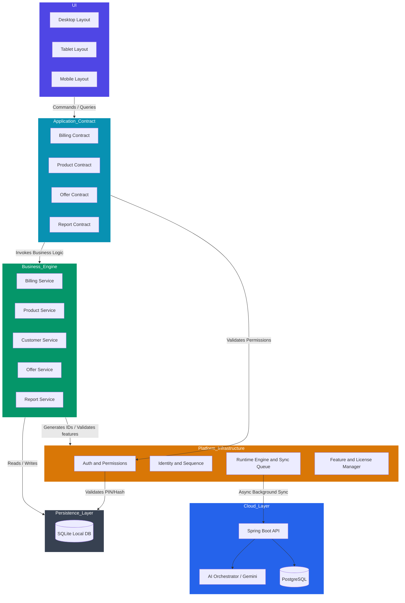
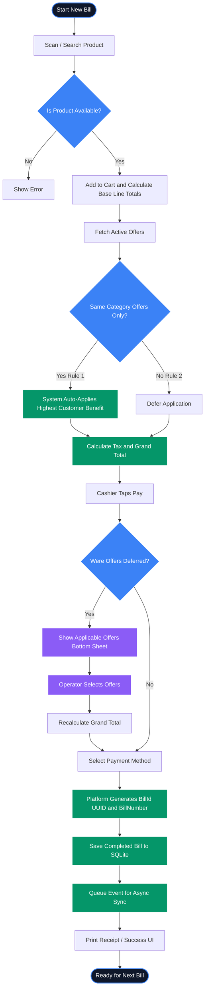
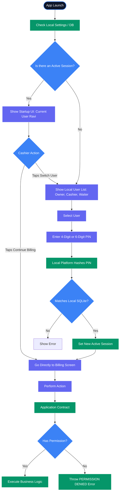

# BizCopilot V1 Diagrams

The following diagrams visually represent the finalized BizCopilot V1 architecture, billing pipeline, and local user experience.

## 1. System Architecture Blueprint

This diagram shows the rigid layer boundaries. The UI never talks to the database, and Business Modules never handle synchronization.

## 2. Core Sales & Offer Flow (The "Fast Billing" Pipeline)

This flowchart illustrates the core billing pipeline, including the G10 Offer Resolution rules that prioritize speed.

## 3. Local Authentication & User Switch Flow

This flowchart illustrates the G11 Local User Management rules, showing the offline-first fast login process.

