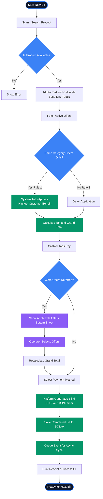

# Core Sales & Offer Flow (The "Fast Billing" Pipeline)

This flowchart illustrates the core billing pipeline, including the G10 Offer Resolution rules that prioritize speed.

```mermaid
flowchart TD
    Start([Start New Bill]) --> AddProduct[Scan / Search Product]
    AddProduct --> CheckAvail{Is Product Available?}
    CheckAvail -- No --> Error[Show Error]
    CheckAvail -- Yes --> BuildCart["Add to Cart and Calculate Base Line Totals"]
    
    BuildCart --> CheckOffers[Fetch Active Offers]
    
    CheckOffers --> CatCheck{Same Category Offers Only?}
    
    CatCheck -- Yes Rule 1 --> AutoApply[System Auto-Applies Highest Customer Benefit]
    AutoApply --> CalcTax["Calculate Tax and Grand Total"]
    
    CatCheck -- No Rule 2 --> Deferred[Defer Application]
    Deferred --> CalcTax
    
    CalcTax --> TapPay[Cashier Taps Pay]
    
    TapPay --> HasMulti{Were Offers Deferred?}
    HasMulti -- Yes --> Popup["Show Applicable Offers Bottom Sheet"]
    Popup --> ApplySel[Operator Selects Offers]
    ApplySel --> Recalc[Recalculate Grand Total]
    Recalc --> PayMethod[Select Payment Method]
    
    HasMulti -- No --> PayMethod
    
    PayMethod --> GenID["Platform Generates BillId UUID and BillNumber"]
    GenID --> Save[Save Completed Bill to SQLite]
    Save --> Queue[Queue Event for Async Sync]
    Queue --> Print["Print Receipt / Success UI"]
    Print --> Finish([Ready for Next Bill])

    %% Styling
    classDef action fill:#0f172a,stroke:#3b82f6,color:#fff,stroke-width:2px;
    classDef decision fill:#3b82f6,stroke:#fff,color:#fff;
    classDef system fill:#059669,stroke:#fff,color:#fff;
    classDef ui fill:#8b5cf6,stroke:#fff,color:#fff;
    
    class Start,Finish action;
    class CheckAvail,CatCheck,HasMulti decision;
    class AutoApply,CalcTax,GenID,Save,Queue system;
    class Popup,ApplySel ui;
```
