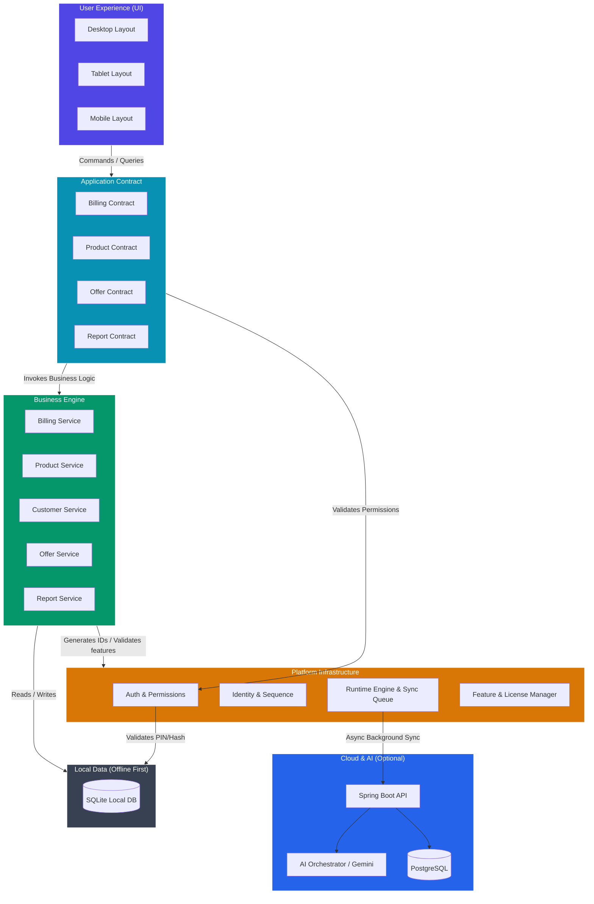

# System Architecture Blueprint

This diagram shows the rigid layer boundaries. The UI never talks to the database, and Business Modules never handle synchronization.

```mermaid
flowchart TD
    %% Layers
    subgraph UI ["User Experience (UI)"]
        D[Desktop Layout]
        T[Tablet Layout]
        M[Mobile Layout]
    end

    subgraph AppContract ["Application Contract"]
        BC[Billing Contract]
        PC[Product Contract]
        OC[Offer Contract]
        RC[Report Contract]
    end

    subgraph BusinessEngine ["Business Engine"]
        Bill[Billing Service]
        Prod[Product Service]
        Cust[Customer Service]
        Off[Offer Service]
        Rep[Report Service]
    end

    subgraph PlatformLayer ["Platform Infrastructure"]
        Auth[Auth & Permissions]
        Id[Identity & Sequence]
        Run[Runtime Engine & Sync Queue]
        Feat[Feature & License Manager]
    end

    subgraph Persistence ["Local Data (Offline First)"]
        DB[(SQLite Local DB)]
    end
    
    subgraph CloudLayer ["Cloud & AI (Optional)"]
        SyncAPI[Spring Boot API]
        CloudDB[(PostgreSQL)]
        AI[AI Orchestrator / Gemini]
    end

    %% Connections
    UI -- "Commands / Queries" --> AppContract
    AppContract -- "Validates Permissions" --> Auth
    AppContract -- "Invokes Business Logic" --> BusinessEngine
    BusinessEngine -- "Generates IDs / Validates features" --> PlatformLayer
    BusinessEngine -- "Reads / Writes" --> Persistence
    Auth -- "Validates PIN/Hash" --> Persistence
    
    Run -- "Async Background Sync" --> SyncAPI
    SyncAPI --> CloudDB
    SyncAPI --> AI
    
    %% Styling
    classDef ui fill:#4f46e5,stroke:#fff,color:#fff;
    classDef contract fill:#0891b2,stroke:#fff,color:#fff;
    classDef business fill:#059669,stroke:#fff,color:#fff;
    classDef platform fill:#d97706,stroke:#fff,color:#fff;
    classDef data fill:#374151,stroke:#fff,color:#fff;
    classDef cloud fill:#2563eb,stroke:#fff,color:#fff;
    
    class UI ui;
    class AppContract contract;
    class BusinessEngine business;
    class PlatformLayer platform;
    class Persistence data;
    class CloudLayer cloud;
```
